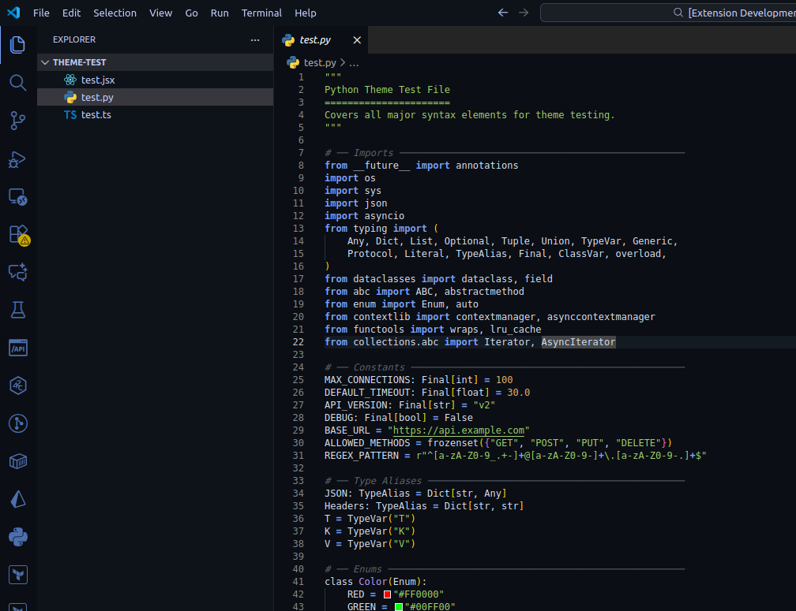
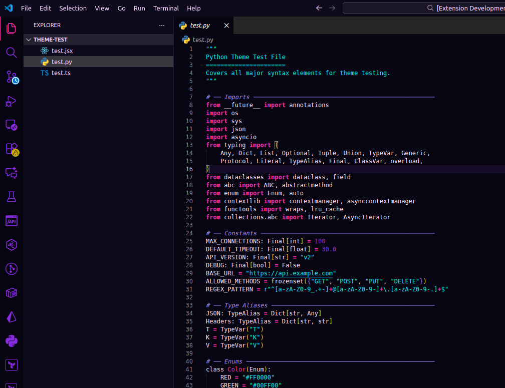
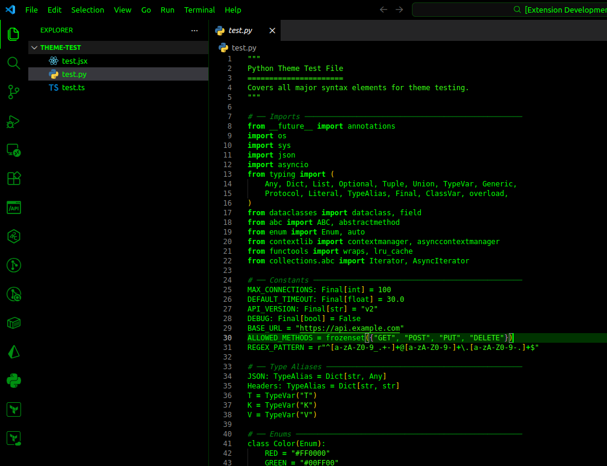

# 🌙 Night-Stack

Night-Stack is a multi-theme dark pack built on a **black-first foundation**, offering hacker-inspired, eye-friendly, colorful, and stack-specific variants tailored for modern development environments.

Designed for full IDE coverage, Night-Stack balances aesthetics, readability, and developer comfort across multiple visual families.

---

## Screenshot





# 🎨 Theme Families

---

## 🧑‍💻 HACKER Spectrum

This family contains hacker-inspired themes built around terminal aesthetics, neon greens, and cyber intrusion visuals.

* **Night-Stack – Pure Hacker**
  A classic matrix-style hacker theme with pure neon green on black.

* **Night-Stack – Green Neon**
  A cyberpunk hacker theme with glowing greens and vibrant accents.

* **Night-Stack – Hacker Soft**
  A toned-down hacker variant optimized for reduced eye strain.

---

## 👁 Eye-Friendly Dev

This family focuses on long coding sessions with low contrast, muted greens, and reduced neon intensity.

* **Night-Stack – EyeStrain Green**
  Soft green palette designed for extended development hours.

* **Night-Stack – Carbon Green**
  Carbon dark base with balanced green highlights.

* **Night-Stack – Sage Dark**
  Nature-inspired sage tones blended with deep dark backgrounds.

---

## 🌈 Color Accent Series

These themes maintain a black foundation while introducing vibrant multi-color accents.

* **Night-Stack – Obsidian**
  Black base with cool blues and soft purples.

* **Night-Stack – Aurora**
  Inspired by northern lights — cyan, magenta, and violet glow.

* **Night-Stack – Midnight Blue**
  Deep ocean blues with teal accents.

* **Night-Stack – Ember Dark**
  Black base with fiery orange and amber tones.

* **Night-Stack – Frost**
  Icy cyan and silver accents over a frozen dark backdrop.

---

## 🧑‍🎨 Color-Accent Dark Series

Single-accent color themes built on pure black backgrounds.

* **Night-Stack – Crimson Dark**
  Black + deep red highlights.

* **Night-Stack – Indigo Dark**
  Black + rich indigo accents.

* **Night-Stack – Teal Dark**
  Black + teal glow highlights.

* **Night-Stack – Amber Dark**
  Black + warm amber tones.

* **Night-Stack – Violet Dark**
  Black + vibrant violet accents.

---

## 🧱 Minimal Dark Series

Ultra-clean dark themes with minimal distractions.

* **Night-Stack – Slate**
  Soft slate grays with subtle accents.

* **Night-Stack – Graphite**
  Industrial graphite tone UI.

* **Night-Stack – Carbon**
  Balanced charcoal dark environment.

* **Night-Stack – Noir**
  Pure cinematic black minimal theme.

---

## 🧪 Tech-Glow Series

Futuristic sci-fi themes inspired by labs, circuits, and energy fields.

* **Night-Stack – Quantum**
  Electric blues with neon violet energy tones.

* **Night-Stack – Plasma**
  Hot pink and cyan plasma glow accents.

* **Night-Stack – Ion**
  Teal-lime fusion over deep black.

* **Night-Stack – Circuit**
  PCB green with golden trace highlights.

---

## 🌃 Cyberpunk Series

High-contrast futuristic city aesthetics.

* **Night-Stack – Neo Tokyo**
  Magenta + cyan neon city palette.

* **Night-Stack – Night City**
  Amber + electric blue cyberpunk tones.

* **Night-Stack – Hologram**
  Violet + aqua holographic glow.

* **Night-Stack – Street Grid**
  Electric purple and red night grid visuals.

---

## 🌄 Nature Dark Series

Organic dark themes inspired by natural environments.

* **Night-Stack – Forest Night**
  Moss green and bark tones.

* **Night-Stack – Ocean Abyss**
  Deep sea teal and abyss blue.

* **Night-Stack – Desert Dusk**
  Sand and burnt orange accents.

* **Night-Stack – Arctic Night**
  Ice blue and polar cyan palette.

---

## 🧱 Material Dark Series

Themes inspired by physical materials and surfaces.

* **Night-Stack – Obsidian Glass**
  Reflective volcanic glass tones.

* **Night-Stack – Titanium**
  Steel gray with cyan highlights.

* **Night-Stack – Copper Dark**
  Copper metal warmth on black.

* **Night-Stack – Onyx**
  Pure black stone with silver accents.

---

## 🎮 Retro Terminal Series

Vintage computing and CRT terminal aesthetics.

* **Night-Stack – Amber CRT**
  Classic amber monitor phosphor glow.

* **Night-Stack – Phosphor Green**
  Old-school green terminal theme.

* **Night-Stack – DOS Blue**
  Retro DOS blue console palette.

* **Night-Stack – Retro Wave**
  Synthwave pink and purple neon grid.

---

## 🧠 Focus / Productivity Series

Low-distraction themes optimized for concentration.

* **Night-Stack – Zen Dark**
  Calm, balanced neutral palette.

* **Night-Stack – Mono Focus**
  Monochrome minimal coding theme.

* **Night-Stack – Low Contrast Pro**
  Reduced saturation for eye comfort.

* **Night-Stack – Deep Work**
  Dark slate environment for focus sessions.

---

## 🧰 Stack Specific

Themes tuned for specific frameworks and languages.

* **Night-Stack – React**
* **Night-Stack – Express**
* **Night-Stack – Vue**
* **Night-Stack – Angular**
* **Night-Stack – .NET**
* **Night-Stack – Rust**
* **Night-Stack – Laravel**
* **Night-Stack – PHP**
* **Night-Stack – Python**

Each stack theme adjusts syntax colors to match ecosystem branding and readability.

---

# ✨ Features

* Full IDE coverage
  (Editor, Terminal, Sidebar, Activity Bar, Status Bar, Panels)

* Dark-first design philosophy

* Multiple aesthetic families

* Green-first hacker identity roots

* Eye-strain optimized variants

* Semantic highlighting support

* Stack-aware syntax tuning

---

# 📦 Installation

Coming soon on VS Code Marketplace.

Install VS Code Extension CLI
```bash
npm i -g @vscode/vsce
```

Generate .vsix
```bash
vsce package
```

For local testing:

```bash
code --install-extension night-stack.vsix
```

---

# 🤝 Contributing

See [CONTRIBUTING.md](CONTRIBUTING.md) for contribution guidelines, branching strategy, and PR workflow.

---

# 📜 License

MIT License — free and open source.
